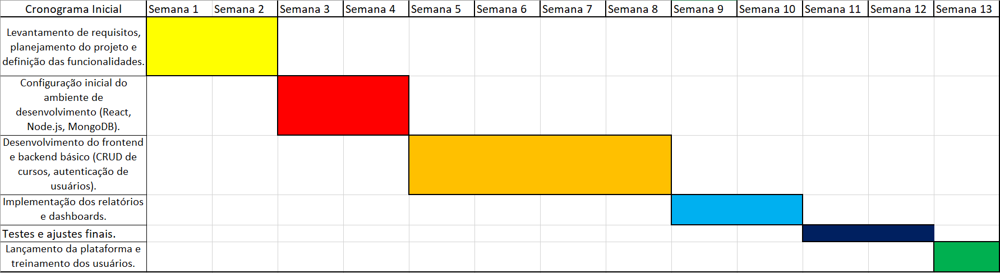
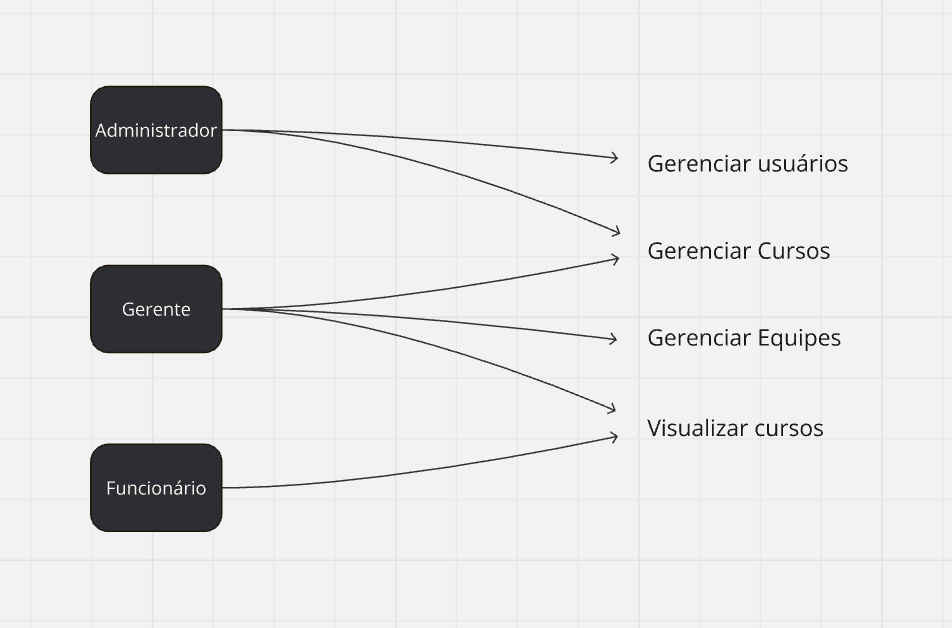
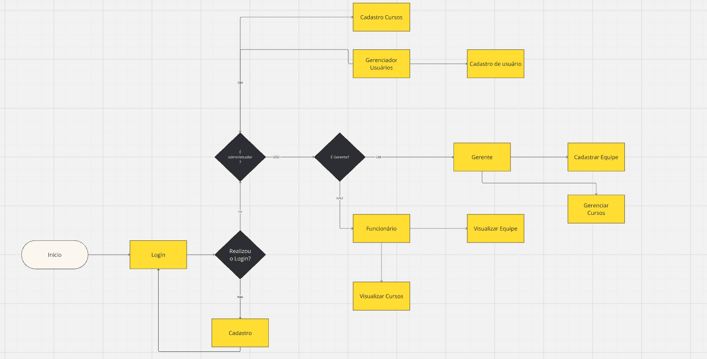

🌟 Escopo do Projeto/documentação:
Nome: Plataforma de Cursos Interna - LLED 🏢

A Plataforma EAD da LLED será um sistema interno inovador para capacitar os funcionários da empresa no setor financeiro e de negócios. O foco está na seleção de cursos por gerentes de equipe e na recomendação de cursos que mais contribuam para a performance dos colaboradores. 🎯
A Plataforma EAD da LLED será um sistema interno inovador para capacitar os funcionários da empresa no setor financeiro e de negócios. O foco está na seleção de cursos por gerentes de equipe e na recomendação de cursos que mais contribuam para a performance dos colaboradores. 🎯
🎯 Objetivos do Projeto:

    🧠 Desenvolvimento contínuo: Prover uma plataforma intuitiva e de fácil uso para capacitar os funcionários.
    💼 Recomendações: Permitir que gerentes de equipes escolham e recomendem cursos.

🚀 Funcionalidades Principais:
3.1. Gerenciamento de Cursos:

    👨‍💼 Gerentes podem selecionar cursos para suas equipes.
    📚 Cursos recomendados pelo administrador estarão disponíveis para todos os funcionários.

3.2. Recomendações e Atribuições de Cursos:

    🎯 Gerentes podem recomendar cursos.
    👩‍💻 Funcionários podem ver as recomendações na sua área de usuário.

3.3. Cadastro e Login de Usuários:

    🔐 Autenticação para gerentes e funcionários (com diferentes níveis de acesso).
    🆕 Cadastro de novos funcionários com permissão do administrador.

3.4. Perfil de Usuário:

    📋 Área para visualizar cursos em andamento e concluídos.
    📊 Progresso visual dos cursos.
    🏅 Histórico de cursos completados.

3.5. Painel Administrativo:

    👑 Administradores podem gerenciar usuários e cursos.

⚙️ Requisitos Técnicos:
4.1. Frontend:

    ⚛️ Desenvolvido com React.js para uma interface dinâmica e responsiva.
    🎨 Integração com Material UI ou Bootstrap para uma UI moderna e amigável.

4.2. Backend:

    🖥️ Node.js com Next para gerenciar a lógica do servidor.
    🔒 Autenticação com JWT (JSON Web Tokens).

4.3. Banco de Dados:

    💾 MongoDB para armazenar informações de usuários, cursos, progresso e relatórios.

4.4. Integração e Comunicação:
🔗 Comunicação entre frontend e backend via API REST.
🗂️ Armazenamento de arquivos de mídia (vídeos, PDFs) em serviços de armazenamento externo.

🗓️ Cronograma Inicial:

    Semana 1-2: Levantamento de requisitos e planejamento do projeto.
    Semana 3-4: Configuração do ambiente (React, Node.js, MongoDB).
    Semana 5-8: Desenvolvimento do frontend e backend básico.
    Semana 9-10: Implementação de relatórios e dashboards.
    Semana 11-12: Testes e ajustes finais.
    Semana 13: Lançamento da plataforma e treinamento dos usuários.

✅ Critérios de Aceitação:

    🧑‍💼 Gerentes podem atribuir e recomendar cursos para seus times.
    👩‍🎓 Funcionários conseguem acessar cursos
    📈 Relatórios de desempenho são acessíveis para gerentes e funcionários.
    🔐 A plataforma é acessível, segura e estável.

⚠️ Análise de Risco:
7.1. Riscos Técnicos:

    ❌ Falta de Integração Adequada entre Frontend e Backend
        Mitigação: Testes contínuos e uso de práticas como TDD.

    ❌ Escalabilidade e Performance da Plataforma
        Mitigação: Otimização de consultas no MongoDB e uso de cache.

    ❌ Falhas de Segurança na Autenticação
        Mitigação: Implementação de autenticação robusta com JWT e criptografia.

7.2. Riscos Operacionais:

    ⏳ Atrasos no Cronograma
        Mitigação: Revisões semanais de progresso.

    📉 Treinamento Insuficiente dos Funcionários
        Mitigação: Sessões de treinamento e suporte contínuo.

7.3. Riscos de Negócio:

    🛑 Baixa Adoção pelos Funcionários
        Mitigação: Interface amigável e incentivo dos gerentes.

    🛠️ Mudanças nas Necessidades de Treinamento
        Mitigação: Desenvolvimento modular para fácil adaptação.

💻 Recursos:
8.1. Recursos Humanos:

    👩‍💻 Desenvolvedores: Frontend (React.js) e Backend (Node.js).
    🛠️ Engenheiro de DevOps: Gerenciar deploy e monitoramento.
    🎨 Designer UI/UX: Prototipagem e design de interface.
    🧪 Testador QA: Testes de funcionalidade e segurança.

8.2. Recursos de Hardware e Software:

    ☁️ Servidores de nuvem: AWS ou Azure.
    🛠️ Ferramentas: React.js, Node.js, MongoDB, Git, Jest, Postman.

8.3. Recursos Financeiros:

    💵 Infraestrutura de Hospedagem: Custos com servidores e armazenamento de mídia.
    💳 Licenças de Software: Para bibliotecas premium, se necessário.
    📚 Treinamento: Orçamento para capacitar os usuários no pós-lançamento.

<h1>Diagrama de uso:</h1>
    

 

   <h1>Diagrama de classe:</h1> 

 
<h1>Diagrama de fluxo:</h1> 
    

 
<h1>Protótipos de baixa fidelidade</h1>

 

<h1>Protótipos de média fidelidade</h1>

 

<h1>Protótipos de alta fidelidade</h1>

<h1>Link do Figma</h1>

    https://www.figma.com/proto/D0r2imlF6zXiGQhT1stnL2/Untitled?node-id=4-103&node-type=canvas&t=DCFvosyUlZ3ylEzY-1&scaling=min-zoom&content-scaling=fixed&page-id=0%3A1

